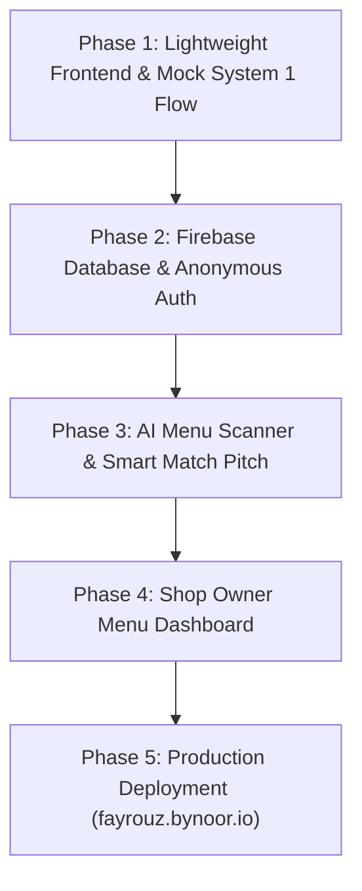

# Fayrouz Core Platform — Master Implementation Plan
> **System 1 Coffee Matcher (Guest Mobile Platform)**  
> **Repository:** `NoorGuru/fayrouz`  
> **Target Domain:** `https://fayrouz.bynoor.io`  

---

## 1. Executive Summary & Vision
Fayrouz eliminates specialty coffee menu fatigue. Using behavioral **System 1 design** (fast, intuitive, emotional), it matches a guest's personal taste with a coffeehouse's live menu in 3 seconds, presenting:
- **3 Top Safe Matches** (with `#1 Perfect Match` highlighted for 1-tap ordering)
- **1 Adventure Pick** ("Wanna try something new?")

---

## 2. Reference: The Fayrouz Demo Ecosystem

This new platform works in tandem with the existing interactive demo and kiosk simulation codebase:

| Resource | Location / Reference | Description |
| :--- | :--- | :--- |
| **Live Demo Site** | [https://fayrouz-demo.bynoor.io](https://fayrouz-demo.bynoor.io) | Hosted GitHub Pages interactive kiosk & barista prototype. |
| **Demo Repository** | `git@github.com:mohnoor94/fayrouz-demo.git` | Renamed demo repository. |
| **Demo Local Directory** | `/Users/noor/Projects/fayrouz-demo` | Local clone of the demo. |

### Core Logic & Assets to Borrow from the Demo:

1. **The 16 Coffee Dialects™ & 5 Sensory Houses**:
   - **File:** `../fayrouz-demo/src/utils/coffeeDialects.js`
   - **5 Houses:**
     - `House of Terroir` (Blue / `#38bdf8`) — High-altitude washed single origins.
     - `House of Alchemy` (Amber / `#f97316`) — Anaerobic ferments, sparkling cascara, botanical brews.
     - `House of Velvet` (Gold / `#eab308`) — Silky oat and dairy microfoam craft.
     - `House of Epicure` (Rose / `#ec4899`) — Levantine saffron, cardamom, pistachio comfort.
     - `Master Roastery Guild` (Purple / `#a855f7`) — Fluid, omnivorous coffee mastery.
   - **4 Cognitive Sensory Axes:**
     - Philosophy: `[T]` Terroir vs `[A]` Alchemy
     - Frequency: `[L]` Luminous vs `[D]` Depth
     - Texture: `[N]` Naked vs `[S]` Silk
     - Rhythm: `[R]` Ritual vs `[V]` Velocity

2. **Persona & Passport Engine**:
   - **File:** `../fayrouz-demo/src/utils/personaGenerator.js`
   - Generates deterministic universal pass IDs (`FYZ-XXXX`), dietary safeguards (`VEGAN`, `NUT_FREE`, `LACTOSE_FREE`), and flavor pillar badges.

3. **Participating Roasters & Host Venues**:
   - **File:** `../fayrouz-demo/src/constants/brandConfig.js`
   - Pre-configured specialty brands:
     - `Ambar` (Ambar Specialty Roasters, Amman & Dubai)
     - `Turath` (Turath Coffeehouse & Roasters, Dubai)
     - `Qahwatna` (Qahwatna Specialty Roasters)
     - `Naranj` (Naranj Artisanal Coffee)
     - `Al-Mada` (Al-Mada Specialty Coffee)

4. **Barista Craft Extraction Specs**:
   - **Folder:** `../fayrouz-demo/src/components/barista/`
   - Exact espresso ratios (`1:1.8` - `1:2.1`), filter ratios (`1:16` - `1:16.5`), water brew temperatures (`91°C` - `93°C`), dose weights, and TDS targets.

5. **Pitch Narrative & Visual Aesthetics**:
   - **Folder:** `../fayrouz-demo/src/components/pitch/`
   - Dark luxury espresso theme (`#120D0A`, `#1A1412`), warm alabaster parchment (`#FBF9F5`), brushed gold accents (`#D4AF37`), and native Arabic calligraphy typography.

### Pitch Alignment: Delivering the Exact Narrative from the Demo (`GuidedPitchModal.jsx`)

The real platform in `NoorGuru/fayrouz` builds the **exact thesis and commercial promise** pitched in the demo:

| Demo Pitch Script (`GuidedPitchModal.jsx`) | How the Real Platform Executes It |
| :--- | :--- |
| **Pitch Step 1: "The Counter Chaos"**<br>“25+ esoteric choices. Customers freeze with choice paralysis. Allergen questions cause hesitation. The average line slows to 95 seconds per order.” | **The Solution:** Completely removes the 25-item catalog overwhelm by delivering an instant, high-confidence Hero Recommendation. |
| **Pitch Step 2: "The Taste Passport"**<br>“Captures dietary guardrails, flavor pillars, roast depth, and sweetness calibration in just 30 seconds, minting their unique Taste Passport.” | **The Solution:** The 30-second mobile quiz captures milk texture, flavor pillars, and temperature preferences without requiring an account or password. |
| **Pitch Step 3: "The 3+1 Decision Engine"**<br>“The 25-item catalog transforms instantly into 3 hyper-personalized matches plus 1 curated discovery pick... drops ordering from 95s to 14s.” | **The Solution:** The exact "3 Safe Matches + 1 Adventure Pick" UI with 1-tap barista ticket generation. |
| **Pitch Step 4: "Allergen Safety & High-Margin ROI"**<br>“Dairy lattes auto-swap to oat milk... Result: +22% ticket lift and 100% allergen compliance.” | **The Solution:** Automatic milk & dietary filtering plus the "Adventure Pick" that sells high-margin specialty micro-lots. |

---

## 3. The System 1 Decision Architecture ("3 + 1" Pattern)

When a customer opens Fayrouz on mobile at a participating coffee shop:

```
┌─────────────────────────────────────────────────────────────┐
│ ⭐ #1 YOUR PERFECT MATCH (98% Match)                         │
│ Oat Velvet Flat White                                       │
│ "Smooth, velvety, and naturally nutty."                    │
│ [ ORDER THIS IN 1 TAP ] ──> Opens Barista Ticket Sheet      │
├─────────────────────────────────────────────────────────────┤
│ 2. Top Alternative: Craft Cortado (92%)                     │
│ 3. Top Alternative: Nitro Blossom Cold Brew (88%)           │
├─────────────────────────────────────────────────────────────┤
│ 🧪 WANNA TRY SOMETHING NEW? (Adventure Pick)               │
│ V60 Experimental Anaerobic Geisha                           │
│ "You love sweet finishes — this tastes like fresh berries." │
│ [ I'M FEELING ADVENTUROUS ]                                 │
└─────────────────────────────────────────────────────────────┘
```

---

## 4. The JEV Decision Model (Judgment, Evaluation, Value)

Fayrouz maps behavioral economics directly to the coffee ordering moment using the **JEV** model:

| JEV Stage | Cognitive Trigger | Fayrouz Product Implementation |
| :--- | :--- | :--- |
| **J — Judgment** *(Fast Intuition & Aesthetic Perception)* | Instant emotional connection; zero cognitive strain; recognizing personal cravings. | • Warm luxury visual cues (rich espresso tones, gold badges, tactile hot/iced cards).<br>• Visual sensory dials (no long text questions).<br>• Instant recognition of flavor cravings (hazelnut, berries, dark chocolate). |
| **E — Evaluation** *(Frictionless Risk Assessment)* | Eliminating doubt: "Will I regret spending $6 on this?"; avoiding choice overload (Hick's Law). | • **High-Confidence Score:** "98% Match for your palate" instantly validates the choice.<br>• **Rule of 3 Picks:** Cuts down 30 choices to 3 safe options to prevent analysis paralysis.<br>• **Plain-Taste Translation:** Translates "anaerobic carbonic" into "tastes like sweet peach tea".<br>• **Adventure Bridge:** Explains *why* the experiment is safe to try. |
| **V — Value** *(Perceived Payoff & Frictionless Action)* | Tangible satisfaction; feeling like an insider; zero anxiety at the counter. | • **1-Tap Barista Ticket:** Instant high-contrast screen to show the cashier/barista across the counter.<br>• **Zero Waste Assurance:** Guaranteed customized cup matched to personal taste.<br>• **Universal Pass Identity:** Carrying a distinct Coffee Dialect across all network coffeehouses. |

### Concrete JEV Use Cases

#### Use Case 1: The Counter Hesitation Buster (Line Queue JEV)
* **Context:** Customer stands in line at Ambar with 5 people behind them. The blackboard lists 25 single-origin brews and esoteric ratios. System 2 gets overwhelmed, customer feels pressured, and defaults to a safe, boring drink they don't really want.
* **J (Judgment):** Customer opens Fayrouz on their phone → instantly sees a bold, appetizing Hero Card for `#1 Perfect Match: Oat Velvet Flat White`.
* **E (Evaluation):** "98% Match" badge + 1 simple sentence: *"Smooth, velvety, and naturally nutty."* All hesitation and fear of regret vanish in 1 second.
* **V (Value):** Taps "Order in 1 Tap" → shows clean barista ticket directly to the cashier. Order done in 3 seconds; customer feels smart, calm, and satisfied.

#### Use Case 2: The Specialty Micro-Lot Upsell (Adventure Pick JEV)
* **Context:** Roasters struggle to sell rare, premium $8+ micro-lots (like anaerobic Geishas or fermented naturals) because regular guests are scared they will taste "sour" or "weird".
* **J (Judgment):** The dedicated **"🧪 Wanna Try Something New?"** card sparks positive curiosity without intimidating the user.
* **E (Evaluation):** The **Adventure Hook** builds an intuitive bridge: *"Because you love sweet finishes, this rare lot tastes like sparkling peach tea rather than normal coffee!"* This neutralizes the customer's risk perception.
* **V (Value):** The guest discovers an extraordinary coffee craft, the coffeehouse sells high-margin beans, and the customer feels like an enlightened coffee explorer.

#### Use Case 3: The Multi-Venue Roaster Hop (Universal Identity JEV)
* **Context:** A customer moves from Amman to Dubai, or from Ambar to Turath. They have no idea what Turath roasts or serves.
* **J (Judgment):** Customer taps "Turath Coffeehouse" in the app selector.
* **E (Evaluation):** Fayrouz automatically recalculates Turath's Yemeni Haraaz beans against their saved taste profile, scoring it 95% match with notes of dark fig and cardamom.
* **V (Value):** Seamless, guaranteed delight in a totally new coffeehouse with zero onboarding friction.

#### Use Case 4: 30-Second Sensory Profiling (Zero-Friction JEV)
* **Context:** Most coffee apps require 10-minute setup, email confirmation, passwords, and 20 survey questions. Users drop off.
* **J (Judgment):** 4 tactile, emoji-driven sensory taps (Milk texture, Flavor mood, Temperature, Strength). No keyboard typing needed.
* **E (Evaluation):** Fast progress bar; zero risk; completed in 30 seconds without signing up.
* **V (Value):** Instant reveal of their #1 Match and their Coffee Dialect archetype.

---

## 5. Technical Architecture

* **Frontend:** Next.js 15 (App Router) + Tailwind CSS (Bilingual Arabic RTL & English LTR).
* **Backend Suite:** Firebase:
  * **Cloud Firestore:** Real-time database for guest taste profiles, coffee shop directories, and live drink menus.
  * **Firebase Auth:** Anonymous sign-in (instant profile with zero signup friction).
  * **Firebase Storage:** Coffee shop logos and menu images.
* **AI Intelligence (Gemini Flash):**
  * **Menu Scanner:** Coffee shop owner takes a photo of their blackboard/paper menu -> Gemini parses drinks, prices, roasts, and flavor notes directly into Firestore.
  * **Plain-Taste Translator:** Translates snobby tasting notes into mouth-watering, plain-language 1-sentence explanations.

---

## 6. Phased Execution Plan (For when work begins)




### Phase 1: Frontend Prototype (Next.js + Mock Data)
1. Initialize Next.js 15 + Tailwind CSS + Lucide icons.
2. Build the luxury design tokens (Espresso `#120D0A`, Alabaster `#FBF9F5`, Gold `#D4AF37`, Fayrouz Teal `#0D9488`).
3. Build **Step 1: 30-Second Taste Quiz** (Milk, Flavor Mood, Temp, Intensity).
4. Build **Step 2: Shop Selector** (Ambar, Turath, Qahwatna from `brandConfig.js`).
5. Build **Step 3: The 3+1 Decision Screen** with 1-tap "Show to Barista" card.
6. Verify mobile responsiveness and Arabic RTL rendering.

### Phase 2: Firebase Integration
1. Initialize Firebase SDK (`npm install firebase`).
2. Implement anonymous auth so user tastes persist in Firestore under `tastes/{tasteId}`.
3. Populate Firestore with seed menus for Ambar and Turath.
4. Connect frontend components to live Firestore listeners.

### Phase 3: Gemini AI Menu Scanner & Match Copywriter
1. Setup Gemini API endpoint (via Next.js route handler `/api/ai/scan-menu`).
2. Add camera upload for coffee shop owners to auto-populate drinks from menu photos.
3. Dynamically generate personalized 1-sentence match explanations.

### Phase 4: Coffee Shop Dashboard
1. A minimal, clean portal for baristas/owners to toggle drink availability (e.g., "Out of Stock" for specific beans) and update prices.

### Phase 5: Domain & Production Launch
1. Connect custom domain `fayrouz.bynoor.io` on Vercel or Cloudflare.
2. Verify SSL and production performance (Lighthouse > 95).

---

## 7. Firestore Database Schema

```typescript
// tastes/{tasteId}
interface UserTaste {
  id: string;
  milkPreference: 'oat' | 'dairy' | 'black' | 'any';
  flavorPreference: 'chocolate_nutty' | 'fruity_floral' | 'sweet_caramel' | 'balanced';
  temperature: 'hot' | 'iced' | 'any';
  intensity: 'light' | 'medium' | 'strong';
  dietaryFlags?: ('vegan' | 'nut_free' | 'lactose_free')[];
  assignedDialect?: string; // e.g. "TLSR - The Silk Alchemist" from demo
  createdAt: timestamp;
}

// coffee_shops/{shopId}
interface CoffeeShop {
  id: string; // e.g. "ambar"
  name: string; // "AMBAR SPECIALTY ROASTERS"
  nameAr: string; // "محمصة عنبر للقهوة المختصة"
  city: string; // "Amman & Dubai"
  established: string; // "2024"
  tagline: string;
  active: boolean;
}

// drinks/{drinkId}
interface Drink {
  id: string;
  shopId: string;
  name: string;
  nameAr: string;
  type: 'espresso_milk' | 'filter' | 'cold_brew' | 'signature';
  roast: 'light' | 'medium' | 'dark';
  milk: 'oat' | 'dairy' | 'black' | 'any';
  temperature: 'hot' | 'iced';
  flavorNotes: string[];
  flavorNotesPlain: string; // System 1 plain translation
  isAdventure: boolean;
  adventureReason?: string;
  price: number;
  specs?: {
    ratio?: string;
    dose?: string;
    temp?: string;
  };
}
```

---

## 8. Master AI Kickoff Prompt (For continuing in this repo)

```text
You are an expert full-stack engineer and UI/UX designer. We are building the real Fayrouz platform (fayrouz.bynoor.io) in this repository (NoorGuru/fayrouz).

Before writing code:
1. Read docs/plans/FAYROUZ_CORE_PLAN.md and SPEC.md in this repository.
2. Note that the interactive demo runs at https://fayrouz-demo.bynoor.io (codebase at /Users/noor/Projects/fayrouz-demo). We borrow our 16 Dialects, brand configuration (Ambar, Turath), and barista extraction specs from that demo codebase.
3. Our core objective is System 1 decision-making: 3 Top Safe Matches (#1 highlighted) + 1 Adventure Pick.

Let's begin Phase 1:
- Initialize Next.js 15 (App Router) + Tailwind CSS + Lucide icons.
- Build the 30-second taste quiz, coffee shop selector, and 3+1 decision card with mock data.
- Ensure luxury specialty coffee styling (espresso, alabaster, gold) and Arabic RTL support.
```
