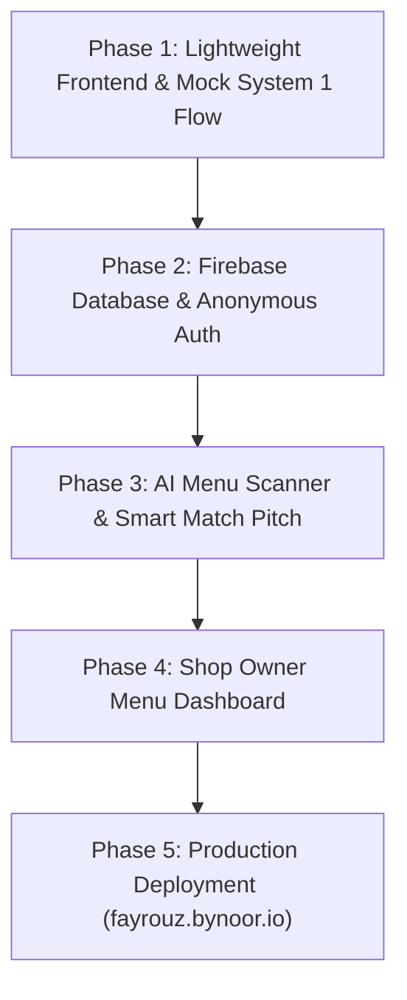

# Fayrouz Core Platform — Master Implementation Plan
> **System 1 Coffee Matcher (Guest Mobile Platform)**  
> **Repository:** `NoorGuru/fayrouz`  
> **Target Domain:** `https://fayrouz.bynoor.io`  

---

## 1. Executive Summary & Vision
Fayrouz eliminates specialty coffee menu fatigue. Using behavioral **System 1 design** (fast, intuitive, emotional), it matches a guest's personal taste with a coffeehouse's live menu in 3 seconds, presenting:
- **3 Top Safe Matches** (with `#1 Perfect Match` highlighted for 1-tap ordering)
- **1 Adventure Pick** ("Wanna try something new?")

---

## 2. Reference: The Fayrouz Demo Ecosystem

This new platform works in tandem with the existing interactive demo and kiosk simulation codebase:

| Resource | Location / Reference | Description |
| :--- | :--- | :--- |
| **Live Demo Site** | [https://fayrouz-demo.bynoor.io](https://fayrouz-demo.bynoor.io) | Hosted GitHub Pages interactive kiosk & barista prototype. |
| **Demo Repository** | `git@github.com:mohnoor94/fayrouz-demo.git` | Renamed demo repository. |
| **Demo Local Directory** | `/Users/noor/Projects/fayrouz-demo` | Local clone of the demo. |

### Core Logic & Assets to Borrow from the Demo:

1. **The 16 Coffee Dialects™ & 5 Sensory Houses**:
   - **File:** `../fayrouz-demo/src/utils/coffeeDialects.js`
   - **5 Houses:**
     - `House of Terroir` (Blue / `#38bdf8`) — High-altitude washed single origins.
     - `House of Alchemy` (Amber / `#f97316`) — Anaerobic ferments, sparkling cascara, botanical brews.
     - `House of Velvet` (Gold / `#eab308`) — Silky oat and dairy microfoam craft.
     - `House of Epicure` (Rose / `#ec4899`) — Levantine saffron, cardamom, pistachio comfort.
     - `Master Roastery Guild` (Purple / `#a855f7`) — Fluid, omnivorous coffee mastery.
   - **4 Cognitive Sensory Axes:**
     - Philosophy: `[T]` Terroir vs `[A]` Alchemy
     - Frequency: `[L]` Luminous vs `[D]` Depth
     - Texture: `[N]` Naked vs `[S]` Silk
     - Rhythm: `[R]` Ritual vs `[V]` Velocity

2. **Persona & Passport Engine**:
   - **File:** `../fayrouz-demo/src/utils/personaGenerator.js`
   - Generates deterministic universal pass IDs (`FYZ-XXXX`), dietary safeguards (`VEGAN`, `NUT_FREE`, `LACTOSE_FREE`), and flavor pillar badges.

3. **Participating Roasters & Host Venues**:
   - **File:** `../fayrouz-demo/src/constants/brandConfig.js`
   - Pre-configured specialty brands:
     - `Ambar` (Ambar Specialty Roasters, Amman & Dubai)
     - `Turath` (Turath Coffeehouse & Roasters, Dubai)
     - `Qahwatna` (Qahwatna Specialty Roasters)
     - `Naranj` (Naranj Artisanal Coffee)
     - `Al-Mada` (Al-Mada Specialty Coffee)

4. **Barista Craft Extraction Specs**:
   - **Folder:** `../fayrouz-demo/src/components/barista/`
   - Exact espresso ratios (`1:1.8` - `1:2.1`), filter ratios (`1:16` - `1:16.5`), water brew temperatures (`91°C` - `93°C`), dose weights, and TDS targets.

5. **Pitch Narrative & Visual Aesthetics**:
   - **Folder:** `../fayrouz-demo/src/components/pitch/`
   - Dark luxury espresso theme (`#120D0A`, `#1A1412`), warm alabaster parchment (`#FBF9F5`), brushed gold accents (`#D4AF37`), and native Arabic calligraphy typography.

---

## 3. The System 1 Decision Architecture ("3 + 1" Pattern)

When a customer opens Fayrouz on mobile at a participating coffee shop:

```
┌─────────────────────────────────────────────────────────────┐
│ ⭐ #1 YOUR PERFECT MATCH (98% Match)                         │
│ Oat Velvet Flat White                                       │
│ "Smooth, velvety, and naturally nutty."                    │
│ [ ORDER THIS IN 1 TAP ] ──> Opens Barista Ticket Sheet      │
├─────────────────────────────────────────────────────────────┤
│ 2. Top Alternative: Craft Cortado (92%)                     │
│ 3. Top Alternative: Nitro Blossom Cold Brew (88%)           │
├─────────────────────────────────────────────────────────────┤
│ 🧪 WANNA TRY SOMETHING NEW? (Adventure Pick)               │
│ V60 Experimental Anaerobic Geisha                           │
│ "You love sweet finishes — this tastes like fresh berries." │
│ [ I'M FEELING ADVENTUROUS ]                                 │
└─────────────────────────────────────────────────────────────┘
```

---

## 4. Technical Architecture

* **Frontend:** Next.js 15 (App Router) + Tailwind CSS (Bilingual Arabic RTL & English LTR).
* **Backend Suite:** Firebase:
  * **Cloud Firestore:** Real-time database for guest taste profiles, coffee shop directories, and live drink menus.
  * **Firebase Auth:** Anonymous sign-in (instant profile with zero signup friction).
  * **Firebase Storage:** Coffee shop logos and menu images.
* **AI Intelligence (Gemini Flash):**
  * **Menu Scanner:** Coffee shop owner takes a photo of their blackboard/paper menu -> Gemini parses drinks, prices, roasts, and flavor notes directly into Firestore.
  * **Plain-Taste Translator:** Translates snobby tasting notes into mouth-watering, plain-language 1-sentence explanations.

---

## 5. Phased Execution Plan (For when work begins)



### Phase 1: Frontend Prototype (Next.js + Mock Data)
1. Initialize Next.js 15 + Tailwind CSS + Lucide icons.
2. Build the luxury design tokens (Espresso `#120D0A`, Alabaster `#FBF9F5`, Gold `#D4AF37`, Fayrouz Teal `#0D9488`).
3. Build **Step 1: 30-Second Taste Quiz** (Milk, Flavor Mood, Temp, Intensity).
4. Build **Step 2: Shop Selector** (Ambar, Turath, Qahwatna from `brandConfig.js`).
5. Build **Step 3: The 3+1 Decision Screen** with 1-tap "Show to Barista" card.
6. Verify mobile responsiveness and Arabic RTL rendering.

### Phase 2: Firebase Integration
1. Initialize Firebase SDK (`npm install firebase`).
2. Implement anonymous auth so user tastes persist in Firestore under `tastes/{tasteId}`.
3. Populate Firestore with seed menus for Ambar and Turath.
4. Connect frontend components to live Firestore listeners.

### Phase 3: Gemini AI Menu Scanner & Match Copywriter
1. Setup Gemini API endpoint (via Next.js route handler `/api/ai/scan-menu`).
2. Add camera upload for coffee shop owners to auto-populate drinks from menu photos.
3. Dynamically generate personalized 1-sentence match explanations.

### Phase 4: Coffee Shop Dashboard
1. A minimal, clean portal for baristas/owners to toggle drink availability (e.g., "Out of Stock" for specific beans) and update prices.

### Phase 5: Domain & Production Launch
1. Connect custom domain `fayrouz.bynoor.io` on Vercel or Cloudflare.
2. Verify SSL and production performance (Lighthouse > 95).

---

## 6. Firestore Database Schema

```typescript
// tastes/{tasteId}
interface UserTaste {
  id: string;
  milkPreference: 'oat' | 'dairy' | 'black' | 'any';
  flavorPreference: 'chocolate_nutty' | 'fruity_floral' | 'sweet_caramel' | 'balanced';
  temperature: 'hot' | 'iced' | 'any';
  intensity: 'light' | 'medium' | 'strong';
  dietaryFlags?: ('vegan' | 'nut_free' | 'lactose_free')[];
  assignedDialect?: string; // e.g. "TLSR - The Silk Alchemist" from demo
  createdAt: timestamp;
}

// coffee_shops/{shopId}
interface CoffeeShop {
  id: string; // e.g. "ambar"
  name: string; // "AMBAR SPECIALTY ROASTERS"
  nameAr: string; // "محمصة عنبر للقهوة المختصة"
  city: string; // "Amman & Dubai"
  established: string; // "2024"
  tagline: string;
  active: boolean;
}

// drinks/{drinkId}
interface Drink {
  id: string;
  shopId: string;
  name: string;
  nameAr: string;
  type: 'espresso_milk' | 'filter' | 'cold_brew' | 'signature';
  roast: 'light' | 'medium' | 'dark';
  milk: 'oat' | 'dairy' | 'black' | 'any';
  temperature: 'hot' | 'iced';
  flavorNotes: string[];
  flavorNotesPlain: string; // System 1 plain translation
  isAdventure: boolean;
  adventureReason?: string;
  price: number;
  specs?: {
    ratio?: string;
    dose?: string;
    temp?: string;
  };
}
```

---

## 7. Master AI Kickoff Prompt (For continuing in this repo)

```text
You are an expert full-stack engineer and UI/UX designer. We are building the real Fayrouz platform (fayrouz.bynoor.io) in this repository (NoorGuru/fayrouz).

Before writing code:
1. Read docs/plans/FAYROUZ_CORE_PLAN.md and SPEC.md in this repository.
2. Note that the interactive demo runs at https://fayrouz-demo.bynoor.io (codebase at /Users/noor/Projects/fayrouz-demo). We borrow our 16 Dialects, brand configuration (Ambar, Turath), and barista extraction specs from that demo codebase.
3. Our core objective is System 1 decision-making: 3 Top Safe Matches (#1 highlighted) + 1 Adventure Pick.

Let's begin Phase 1:
- Initialize Next.js 15 (App Router) + Tailwind CSS + Lucide icons.
- Build the 30-second taste quiz, coffee shop selector, and 3+1 decision card with mock data.
- Ensure luxury specialty coffee styling (espresso, alabaster, gold) and Arabic RTL support.
```
